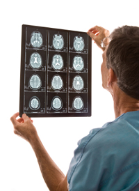

import Expander from '../../../src/components/Expander'

The risk of cerebrovascular adverse events, such as stroke, may be raised as much as three-fold in elderly patients with dementia prescribed an antipsychotic; mortality rate is also raised.

### Factors which increase risk

The risk of stroke is raised in people with:

* cardiovascular disorders such as hypertension, previous stroke, atrial fibrillation, and heart valve disorders
* diabetes
* hypercholesterolaemia and dyslipidaemia
* adverse lifestyle factors including cigarette smoking, excessive weight, excessive alcohol consumption, lack of exercise
### Risk-reduction measures

Antipsychotics should be prescribed for behavioural control in elderly patients with great care and usually only if non-pharmacological treatments have failed.

Where possible, modifiable risk factors (smoking, body weight, alcohol consumption and immobility) should be addressed as should cardiovascular disorders that increase the risk of cerebrovascular events.

