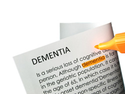

import Expander from '../../../src/components/Expander'

In elderly patients with dementia, use of antipsychotics is associated with increased risk of stroke and transient ischaemic attack and a small increase in mortality rate.

[Inappropriate and excessive use of antipsychotics](http://www.mhra.gov.uk/Safetyinformation/DrugSafetyUpdate/CON152729) has been reported in elderly patients with dementia. An antipsychotic should not be used as first-line management for non-cognitive behavioural and psychological symptoms of dementia in the elderly, unless the symptoms are severe or there is immediate risk of harm to the patient or others.

In view of the risks of cerebrovascular events and increased mortality rate, NICE recommends avoiding use of an antipsychotic for patients with Alzheimer’s disease, vascular dementia, or mixed dementias, or for patients with Lewy body dementia with mild or moderate non-cognitive symptoms.

### Factors which increase risk

Patients with Lewy body dementia are particularly at risk of severe adverse reactions of antipsychotics such as extrapyramidal effects[^1].

Factors that increase mortality rate include age above 65 years, dysphagia[^2], sedation, malnutrition, dehydration, lung disorders (eg pneumonia), and use of a benzodiazepine.

### Risk-reduction measures

Whenever possible, non-pharmacological approach should be used to manage behavioural and psychological symptoms of dementia; this involves behavioural, psychological and psychosocial therapies, multisensory stimulation and physical therapies such as massage. It is recommended that carers are given relevant training.

A patient already receiving low-dose antipsychotic should be reviewed and in the absence of sound justification for the antipsychotic, its discontinuation should be considered and, if necessary, alternative treatment instituted.

### Treatment

If non-pharmacological management of severe behavioural or psychological symptoms of dementia has been unsuccessful, an antipsychotic may be used provided that the benefits of treatment and adverse effects (particularly cerebrovascular risks) are fully discussed with the patient and carers. The drug should be selected on an individual basis, started at low dose, and monitored regularly.

Risperidone is licensed for short-term (up to 6 weeks) treatment of persistent aggression in moderate or severe Alzheimer’s dementia and then only if non-pharmacological treatment has been unsuccessful and there is a risk of harm to self or others.

  
**Further reading on this topic:**

NICE/Social Care Institute for Excellence. [Dementia: supporting people with dementia and their carers in health and social care](http://www.nice.org.uk/CG42). Clinical Guidelines CG42. London, NICE, 2006

Banerjee S. [The use of antipsychotic medication for people with dementia: time for action](http://www.dh.gov.uk/en/Publicationsandstatistics/Publications/PublicationsPolicyAndGuidance/DH_108303). Department of Health, 2009

Dementia Action Alliance, Royal College of General Practitioners, Department of Health. [Optimising treatment and care for people with behavioural and psychological symptoms of dementia: A best practice guide for health and social care professionals](http://www.alzheimers.org.uk/site/scripts/download_info.php?fileID=1163). Alzheimer’s Society. 2011

[^1]: Extrapyramidal symptoms or side effects describe movement disorders such as acute dystonia, parkinsonian effects, akathisia and tardive dyskinesia; these effects result from disturbance—by dopamine antagonists—of the extrapyramidal system, which is responsible for involuntary reflexes and coordination of movement. (The voluntary movement system runs through the ‘pyramidal pathways’ of the medulla of the brain).

[^2]: Difficulty or pain on swallowing
