import Expander from '../../../src/components/Expander'

Taken from: British Approved Names 2012, published by The Stationery Office on behalf of the Medicines and Healthcare products Regulatory Agency

<table>
 <tr>
  <td>
   

    <strong>
     Amisulpride
    </strong>
   

  </td>
  <td>
   

    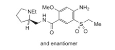
   

  </td>
 </tr>
 <tr>
  <td>
   

    <strong>
     Aripiprazole
    </strong>
   

  </td>
  <td>
   

    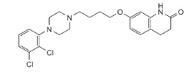
   

  </td>
 </tr>
 <tr>
  <td>
   

    <strong>
     Asenapine
    </strong>
   

  </td>
  <td>
   

    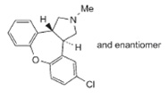
   

  </td>
 </tr>
 <tr>
  <td>
   

    <strong>
     Chlorpromazine
    </strong>
   

  </td>
  <td>
   

    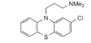
   

  </td>
 </tr>
 <tr>
  <td>
   

    <strong>
     Clozapine
    </strong>
   

  </td>
  <td>
   

    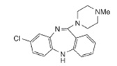
   

  </td>
 </tr>
 <tr>
  <td>
   

    <strong>
     Flupentixol
    </strong>
   

  </td>
  <td>
   

    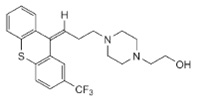
   

  </td>
 </tr>
 <tr>
  <td>
   

    <strong>
     Haloperidol
    </strong>
   

  </td>
  <td>
   

    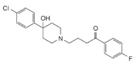
   

  </td>
 </tr>
 <tr>
  <td>
   

    <strong>
     Olanzapine
    </strong>
   

  </td>
  <td>
   

    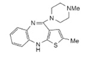
   

  </td>
 </tr>
 <tr>
  <td>
   

    <strong>
     Quetiapine
    </strong>
   

  </td>
  <td>
   

    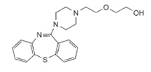
   

  </td>
 </tr>
 <tr>
  <td>
   

    <strong>
     Risperidone
    </strong>
   

  </td>
  <td>
   

    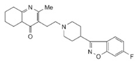
   

  </td>
 </tr>
 <tr>
  <td>
   

    <strong>
     Sulpiride
    </strong>
   

  </td>
  <td>
   

    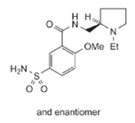
   

  </td>
 </tr>
</table>

