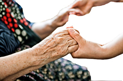

import Expander from '../../../src/components/Expander'

The elderly are more prone to the adverse effects of benzodiazepines because of:

* Reduced capacity to metabolise benzodiazepines as well as reduced renal excretion. This may result in accumulation of the drug.
* Increased sensitivity to the effects of benzodiazepines (unrelated to pharmacokinetic changes).
In particular, the elderly are at greater risk of:

* Memory impairment
* Impaired cognitive function
* Poor psychomotor[^1] performance
* Falls, which might result in injury, such as hip fracture
* Behaviour disinhibition[^2]—often manifesting as irritability and argumentativeness
It is likely that many long-term users of benzodiazepines are elderly.

### Factors which increase risk

Frailty increases the risk of harm from benzodiazepine adverse effects; in addition to weakness, reduced function of various body organs and systems can further contribute to complications.

Many elderly people receive several medicines (‘polypharmacy’); this raises the potential for interaction with benzodiazepines, thereby increasing the risk of excessive sedation, respiratory and cardiovascular impairment, and mental effects such as confusion.

### Risk-reduction measures

Having established that a benzodiazepine is essential for treatment, the initial dose in the elderly should generally be half the usual adult dose.

A short-acting benzodiazepine should be chosen for the elderly to reduce the possibility of accumulation and consequent side effects.

With support and encouragement, it may be possible to help elderly long-term users of benzodiazepines to come off them and benefit from reversal of reduced mental acuity and memory.

[^1]: Level of consciousness or cognitive ability linked to motor behaviour

[^2]: Loss of inhibition which can lead to lack of restraint and disregard for social conventions
