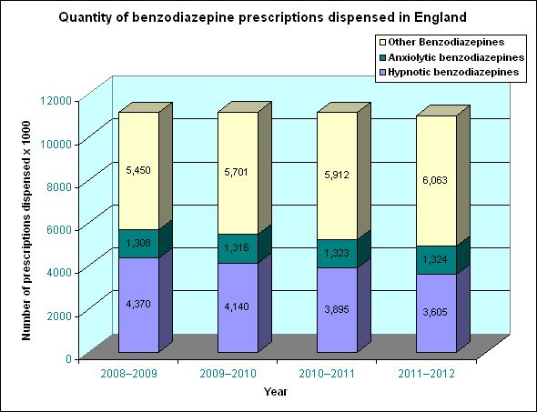
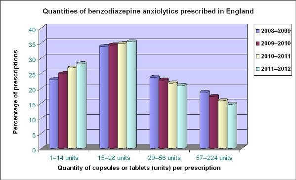
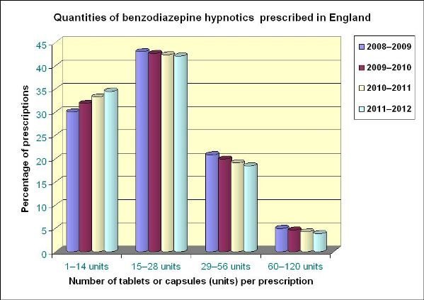

import Expander from '../../../src/components/Expander'

**Prescribing figures featured in this section have been kindly supplied by Prescription Services of the NHS Business Services Authority.**

Primary-care prescribing of benzodiazepine in England has been relatively constant between April 2008 and April 2012, ranging between 10.9 and 11.1 million prescriptions annually.

The prescribing of benzodiazepine hypnotics (flurazepam, loprazolam, lormetazepam, nitrazepam, and temazepam) has declined over the 4-year period, while that of benzodiazepine anxiolytics (alprazolam, chlordiazepoxide, lorazepam, and oxazepam) has increased slightly, but prescribing has increased most for benzodiazepines that can be used for other purposes (clobazam, clonazepam, diazepam, and midazolam).

Though these figures of the number of prescriptions indicate the overall trend, they cannot be used for further analysis because the number of dosage units prescribed has not been taken into account.

Anxiolytic and hypnotic benzodiazepines should be prescribed for no longer than 2–4 weeks and, therefore, prescriptions should ideally be for up to 14 capsules or tablets and no more than 28. Occasionally when the dose is 2 capsules or tablets, these quantities can be doubled.

The following charts—for anxiolytics and hypnotics—show the quantities of capsules or tablets actually prescribed on primary care prescriptions dispensed in England between 2008 and 2012.

For anxiolytics, the trend towards increasing proportion of prescriptions for quantities of less than 28 capsules or tablets is encouraging but, though declining, there is still very substantial amount of prescribing of higher quantities. A group of individuals who have become dependent as a result of regular repeat prescriptions over months or years and who are not able to discontinue the benzodiazepine may, in part, account for the high quantities of capsules or tablets per prescription.

As with the anxiolytic benzodiazepines, the proportion of hypnotic prescriptions for up to 14 capsules or tablets is increasing. This is partly balanced by the corresponding declining proportion of prescriptions for larger quantities. However, between 20 and 25% of hypnotic prescribing is for quantities greater than 28 units and appears to be at odds with the advice to limit the duration of benzodiazepine hypnotic treatment to two to four weeks.

