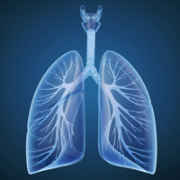

import Expander from '../../../src/components/Expander'

## Activity

Jacqueline, a 57-year-old lady, is a 30-a-day smoker with mild chronic obstructive pulmonary disease. She recently sought your advice on smoking cessation. She works full-time as a book-keeper and has recently moved out of a council flat into a house, which she and her partner have purchased. The busy railway line running behind Jacqueline’s new house is keeping her awake and affects her concentration at work. Which one of the following actions might seem reasonable in these circumstances:

1. Advise Jacqueline about fixed time for bedtime and waking; avoiding alcohol, coffee and nicotine for a few hours before bedtime; taking light meals in the evening; exercising regularly (only gentle exercise in the evening); and comfortable sleeping environment. Ask Jacqueline to persevere with these for a week or two
2. Supply a 4-week course of temazepam 10 mg with the plan to review how she gets on at the end of the course. Advise Jacqueline that after taking the tablets for a few days she will feel less ‘knocked out’ as her body gets used to them
3. Renew efforts to help Jacqueline quit smoking
4. Supply 5 tablets of temazepam 10 mg with instructions to take a tablet at bedtime only if sleep hygiene measure are not proving adequate and recruit Jacqueline’s partner to check on her breathing

<Expander title="Click here for possible answer">
 

  1. It is best to start with the advice on sleep hygiene and seeing how this goes. Making changes to Jacqueline’s preparation for bedtime is a better option than to start her on a hypnotic medicine. A 5-day supply of temazepam (4) might be a second-line option if sleep hygiene measures fail; the possibility of clinically significant respiratory depression should be borne in mind. Supplying a hypnotic for any longer, especially without intervening checks, would be inappropriate. Quitting smoking, though a desirable long-term goal, might best be delayed until Jacqueline has settled down and the stress of moving house is well behind her.
 

</Expander>

Benzodiazepine-induced respiratory depression results from their general property of depressing the CNS. However, unlike barbiturates and volatile general anaesthetics, a benzodiazepine is very unlikely to cause profound and life-threatening respiratory depression.

Respiratory side effects of benzodiazepines are not generally troublesome. The most frequent effect is reduced respiratory rate; less frequent adverse effects include worsening of other underlying respiratory condition including obstructive airways disease. Very rare side effects include dyspnoea, laryngospasm and respiratory arrest (see also under [Overdose](/benzodiazepines/CON234573_12)).

### Factors which increase risk

Factors that increase the risk of respiratory adverse effects include airway disease, CNS depression from another cause, coma, neuromuscular disorders such as myasthenia gravis[^1], and sleep apnoea syndrome.

Hepatic or renal impairment can reduce clearance of benzodiazepines and increase the risk of respiratory depression. Children are also at greater risk of respiratory depression. Cerebral sensitivity may be increased in those with renal impairment and, consequently, such individuals are at higher risk of respiratory depression. The elderly and the debilitated are also at higher risk of adverse respiratory events.

Co-administration of a benzodiazepine with other CNS depressants—including alcohol, antidepressants, sedative antihistamines[^2], antipsychotics, general anaesthetics, other hypnotics or anxiolytics, and opioid analgesics—can increase the risk of respiratory adverse effects.

Intravenous administration of a benzodiazepine increases the risk of significant respiratory depression.

### Risk-reduction measures

The recommended dose of a benzodiazepine should not be exceeded and a lower dose may need to be selected when given in conjunction with an opioid in anaesthesia.

Benzodiazepines should be avoided, or used at a low dose and with careful monitoring, in respiratory depression, neuromuscular respiratory weakness and myasthenia gravis, acute pulmonary insufficiency, and in individuals with obstructive sleep apnoea syndrome.

A benzodiazepine should be given with care to elderly or debilitated people because they are more prone to adverse effects. The dose should also be reduced in hepatic or renal impairment.

Facilities for resuscitation must be at hand when a benzodiazepine is given intravenously (eg in anaesthesia, for delirium tremens or status epilepticus); the benzodiazepine should be injected slowly.

### Treatment

If respiratory symptoms are of concern the benzodiazepine should be stopped or the dose reduced. The treatment of severe benzodiazepine-induced respiratory insufficiency is generally symptomatic and supportive. Flumazenil, a benzodiazepine antagonist, can be given to specifically reverse benzodiazepine CNS effects, but flumazenil must not be used if the benzodiazepine has been taken with another CNS depressant.

[^1]: A progressive illness with fatigue and muscle weakness, which results from impaired muscle response to nerve impulse (because of autoimmune disorder affecting the neuromuscular junction)

[^2]: A substance that blocks the effects of histamine. Histamine is released when the body mounts an immune response and it is responsible for many allergy-related symptoms
