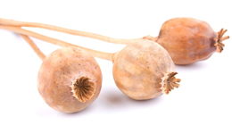

import Expander from '../../../src/components/Expander'

Opioid analgesics comprise substances derived from opium (the opiates[^1]) as well as synthetic substances that act on opioid receptors in the body. Clinically, opioids are used mainly as analgesics but they can also be used for their cough-suppressant effect and to reduce intestinal motility. Some opioids are used in the management of opioid dependence[^2].

Opioids form a key component in the World Health Organization’s ‘[analgesic ladder](http://www.who.int/cancer/palliative/painladder/en)’ for managing cancer pain.

Opioids are generally full agonists[^3] at the opioid receptor but some, such as buprenorphine and pentazocine, are mixed agonist–antagonist[^4] compounds. In addition to opioid agonist effect, tapentadol has noradrenergic activity which contributes to its analgesic effect. Tramadol is an opioid analgesic with noradrenergic and serotonergic[^5] properties which may also contribute to the analgesic effect.

The opioids diphenoxylate (combined with atropine as co-phenotrope) and loperamide are used for managing diarrhoea only; both are derived from pethidine. Loperamide is metabolised in the liver and very little of the intact drug enters the general circulation. Diphenoxylate has no analgesic effect; atropine is included in the formulation to deter abuse[^6] of diphenoxylate. Diphenoxylate and loperamide are not considered in the discussion of opioid risks, below.

In England, over 21.5 million primary-care prescriptions were dispensed for opioid analgesics in 2013; over 35% of these were for tramadol. A further 3.4 million prescriptions were for opioids licensed specifically for managing opioid dependency.

[^1]: A narcotic substance derived from the opium poppy

[^2]: Dependence is a state that develops as a result of repeated use of a certain chemical substance (eg alcohol, benzodiazepine, opioid, or even medicines for reducing blood pressure). It represents the resetting of homeostasis because of the persisting presence of the chemical substance

[^3]: A chemical substance that binds to a receptor and mimics the effect of the physiological (endogenous) substance binding to the receptor

[^4]: A substance that binds to a receptor but produces no effect and inhibits an agonist from binding to the receptor

[^5]: A chemical agent (or synapse) that produces its effects via the serotonin transmitter system

[^6]: Any use of an illegal drug or use of a medicine for a non-therapeutic purpose (eg to alter state of consciousness or to seek a ‘high’)
