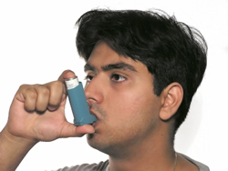

import Expander from '../../../src/components/Expander'

Opioid-induced histamine release can aggravate **bronchoconstriction[^1]**.

Opioids depress respiration by their action on the respiratory centre at the base of the brain but clinically significant **respiratory depression** is relatively rare with therapeutic doses. Excessive doses, especially in those who have not developed opioid tolerance[^2], can have serious respiratory effects (see [Overdose](/opioids/CON143740_15)). Opioids which are very rapidly metabolised (ie those with very short half-lives) are used for deliberate depression of respiration in artificially ventilated patients.

### Factors which increase risk

Individuals with asthma are particularly prone to an asthmatic attack when treated with an opioid.

Conditions such as sleep apnoea, pulmonary disease, emphysema, and even severe obesity can compromise respiration in those taking opioids. Head injury could increase the potential of opioids to reduce respiratory drive. Adverse respiratory effects are increased by concomitant use of other respiratory depressants such as anaesthetics and benzodiazepines[^3].

### Risk-reduction measures

Avoid an opioid during an acute attack of asthma.

Advise patients to take care to avoid excessive dose of an opioid (eg inadvertent duplication of a dose). Avoid increasing the dose too quickly. In those at particular risk of respiratory depression, if an opioid needs to be given, select a lower initial dose; generally avoid use of an opioid in those with chronic obstructive pulmonary disease.

### Treatment

Treat bronchoconstriction[^4] with a short-acting beta2agonist[^5], such as salbutamol.

Significant respiratory depression calls for naloxone injection to reverse the opioid effect (see [Overdose](/opioids/CON143740_15)), but naloxone also reverses opioid analgesia. Since naloxone has a short duration of action, monitor the patient carefully for further deleterious respiratory effects.

[^1]: Narrowing of the airways (bronchioles), reducing the flow of air into the lungs; asthma is characterised by bronchoconstriction

[^2]: Tolerance follows repetitive exposure to a drug, leading to a reduction of the pharmacological effect of that drug

[^3]: Class of medicines which have a sedating effect, most often used for anxiety and insomnia, but also used for muscle relaxation, managing convulsions, and as premedication for surgery and certain procedures. The class includes: chlordiazepoxide, diazepam, flurazepam, lorazepam, midazolam, nitrazepam, oxazepam, and tempazepam

[^4]: Narrowing of the airways (bronchioles), reducing the flow of air into the lungs; asthma is characterised by bronchoconstriction

[^5]: A chemical substance that binds to a receptor and mimics the effect of the physiological (endogenous) substance binding to the receptor
