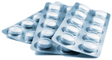

import Expander from '../../../src/components/Expander'

**Rare and very rare, but potentially serious adverse effects.**

Patients with depression[^1] are at increased risk of self-harm and suicide; suicidal thoughts may persist until there is significant improvement of depression.

### Factors which increase risk

The activating effects of antidepressants may lead to an increase in motivation before any mood-lifting effects occur, leading to increased risk of suicidal behaviour.

Analysis of placebo-controlled clinical trials of antidepressant drugs in adults with psychiatric disorders has indicated an increased risk of suicidal behaviour with antidepressants compared to placebo in younger patients (less than 25 years old).

Patients with psychiatric conditions other than depression may be at increased risk of depression. Patients with a history of suicidal behaviour or thoughts or those with significant degree of suicidal ideation should also be monitored carefully.

### Risk-reduction measures

Regular review of patients commencing antidepressant treatment, particularly those with suicidal thoughts or with personal or family history of suicidal behaviour, is advised; young adults should be monitored carefully. For those at high risk, admission to a psychiatric hospital may be necessary when commencing treatment.

SSRIs other than fluoxetine should not be used for treating depression in children and adolescents (aged less than 18 years). The treatment of depression in children and adolescents should be initiated and monitored under specialist supervision. Of the other SSRIs, only fluvoxamine and sertraline are licensed for use in children and adolescents, both for obsessive–compulsive disorders.

### Treatment

An increase in suicidal impulses or behaviours following initiation of SSRI treatment should be taken seriously. Referral to specialist mental health services may be necessary. Sudden cessation of treatment is not recommended without first taking advice from specialist mental health services.

[^1]: A psychiatric disorder characterised by lowered mood, reduced energy and decreased activity. The severity of a depressive episode is divided clinically into mild, moderate and severe subtypes (the latter may or may not have psychotic features). Repeated episodes of depression, without a history of mania, are classified as recurrent depressive disorder.
