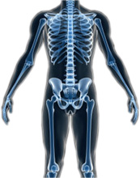

import Expander from '../../../src/components/Expander'

**Rare and very rare, but potentially serious adverse effects.**

Epidemiological studies indicate that antidepressants including SSRIs are associated with a small increased risk of fractures. The mechanism for this increased risk is not understood. Some studies have found decreased bone mineral density in patients taking SSRIs, but other studies have not been able to confirm this.

### Factors which increase risk

Individuals aged over 50 years may be at greater risk of antidepressant-associated fractures.

