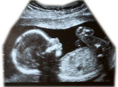

import Expander from '../../../src/components/Expander'

The decision to prescribe an antidepressant during pregnancy involves very careful assessment of risks to the mother and fetus of untreated depression[^1] during the pregnancy and the risks to the fetus of adverse effects including teratogenic effects[^2] from exposure to an antidepressant. Depending on the indication and nature of treatment, effective non-pharmacological therapy may be appropriate during the pregnancy. Specialist advice should be sought in all cases.

The use of an SSRI during pregnancy for indications other than depression should also entail similar careful assessment to ensure that the risks to mother and baby do not outweigh potential benefit

Use in early pregnancy of certain SSRIs is associated with a small risk of congenital cardiac defects; the possibility that this is a class effect cannot be ruled out. A slightly increased risk of overall congenital malformations when used in the first trimester has also been identified with one SSRI. Use of an SSRI during pregnancy, especially in late pregnancy, may increase the risk of persistent pulmonary hypertension in the newborn.

Infants born to mothers who have taken an SSRI during late pregnancy or just before labour may suffer from irritability, tremor, hypotonia, persistent crying, and difficulty in suckling or sleeping. The symptoms may result either from serotonergic[^3] effect or from SSRI withdrawal.

SSRIs (and sometimes their metabolites) are present in breast milk; in most cases their effect on the infant has not been established. Specialist advice should be sought if SSRI treatment is required while breast-feeding.

There is insufficient reliable data on SSRI use during pregnancy and breast-feeding and it is not possible to give definitive advice. Further guidance will be issued as more information becomes available.

**The following sources may be consulted for further information:**

* [Antenatal and postnatal mental health: the NICE guideline on clinical management and service guidance](http://www.nice.org.uk/nicemedia/live/11004/30431/30431.pdf) (external link)  
  

* [UK Teratology Information Service](http://www.uktis.org/) (external link)  
 telephone 0844 892 0909  
  

* [Medicines Information Service specialist advice on drugs in lactation](http://www.ukmicentral.nhs.uk/drugpreg/guide.htm) (external link)  
 telephone 0121 424 7298 (Birmingham) or 0116 258 6491 (Leicester)

[^1]: A psychiatric disorder characterised by lowered mood, reduced energy and decreased activity. The severity of a depressive episode is divided clinically into mild, moderate and severe subtypes (the latter may or may not have psychotic features). Repeated episodes of depression, without a history of mania, are classified as recurrent depressive disorder.

[^2]: An abnormality of embryonic development caused by an external agent. An example would be a birth defect caused by the effects of a drug. The first three months of fetal development (first trimester) are particularly sensitive to teratogenic effects of medicines.

[^3]: A chemical agent (or synapse) that produces its effects via the serotonin transmitter system.
