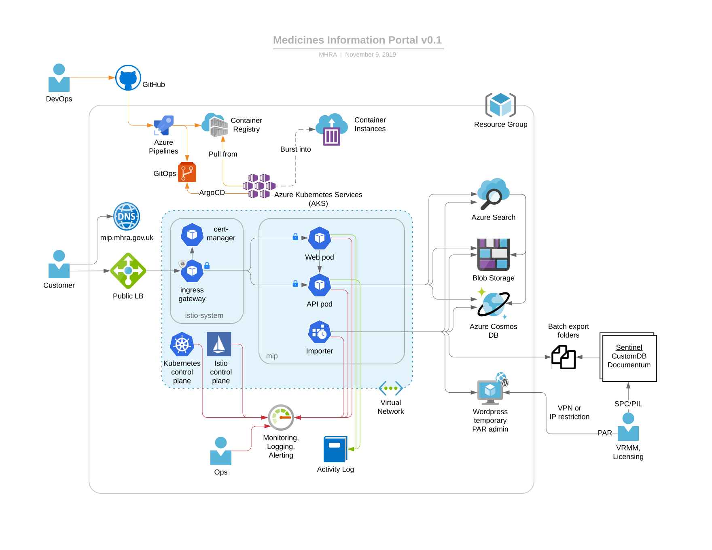

# Medicines Information Portal

The diagram above shows how we can leverage Azure’s Kubernetes Service (AKS) to host an API pod for the medicines microservice, a Web pod for the (initially static) website, and an importer “cronjob” pod which periodically imports data from Sentinel’s batch export process and from the internal Wordpress instance. Although each pod is only shown once, in reality there are multiple instances of each, for reliability (across zones) and scalability (new instances can be created and destroyed automatically and in just a few seconds).

The shaded blue area is the Kubernetes (K8s) cluster, which also hosts an Istio ingress gateway. This is the entrypoint for all requests incoming from the Internet. It terminates SSL using certificates automatically renewed (from [Let’s Encrypt](https://letsencrypt.org/)) by the certificate manager pod. The gateway allows us to do host- and path-based routing to services within the cluster, and we can apply Istio policies, e.g. rate limiting, here.

Documents would be stored in Azure Blob Storage, named after a digest of their contents. This is called content-based addressing and means that two identical documents resolve to the same name giving us deduplication for free. An updated document would resolve to a new name, giving us version history for free. We can keep historical documents for ever as storage is very cheap and effectively infinite.

Metadata for the medicines (including lists of associated documents) would be stored as a JSON object in Azure CosmosDB. Azure Search would index both the documents (pdf and Blob Storage are both supported) and the metadata (CosmosDB is supported). Azure search also has AI plugins for features such as phrase detection. This would give us a rich, relevant search experience similar to that provided by commercially available search engines such as Google or Bing).

The API pod would contain a lightweight custom HTTP server, written in a language like Go or Rust. It would be stateless so it can scale out with ease. It aggregates data from all three sources and presents a documented API that conforms to the [Open API 3.0 specification](https://github.com/OAI/OpenAPI-Specification/blob/master/versions/3.0.2.md). It would be read-only to start with.

The Web pod would initially serve static HTML, CSS and JS files for the bulk of the site. Later on, a decision could be made as to whether this needs to be content managed. The search component would slot into the static site and be client-side React.

The importer pod would be scheduled to run weekly by the K8s scheduler. It would also be written in a language like Go or Rust and would read the files exported from Sentinel, validate and process them before storing data and PDFs to Cosmos and Blob Storage respectively, triggering Azure Search to update its indexes. This would be a temporary component that would be deprecated as the management function is migrated here from Sentinel.

We may well be able to carve off an MHRA subdomain and manage this in Azure too. The root “A” record would point to the load balancer. We would need to ask GDS to set up “301” redirects for existing URLs.

## Updates

### 6th November 2019

In the spirit of [evolutionary architecture](https://www.thoughtworks.com/insights/blog/microservices-evolutionary-architecture), we’ve updated this design so that the temporary wordpress site will now only be used for uploading Public Assessment Reports (PARs). Only staff with admin capability will be able to access the site and it will only be visible within the MHRA organisation. The “importer pod” will now import PARs from the wordpress API (as well as the SPCs and PILs from the Sentinel batch export).

This has several benefits:

- The Wordpress site would not be accessible by the public
- Overall security is significantly improved as no external access or login capability required
- A more consistent user experience
- No duplication of the surrounding website content
- A single search index and user experience for all docs (SPC/PIL/PAR)
