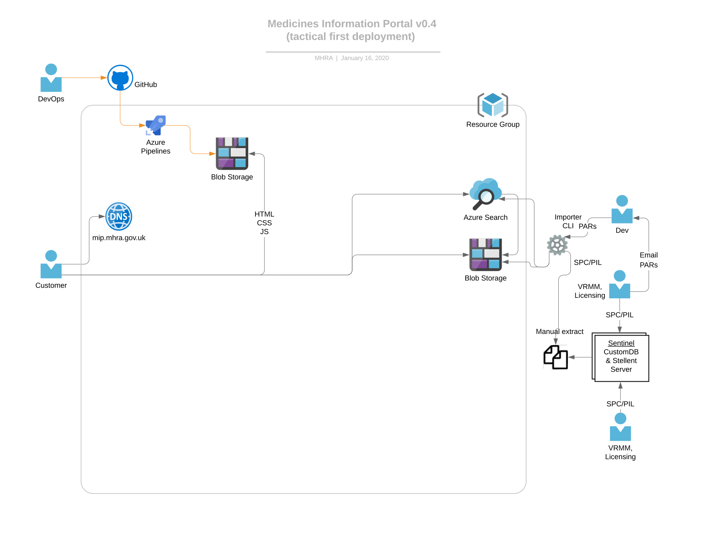

# Project architecture

The diagram above shows how we use Azure’s Kubernetes Service (AKS) to host an API pod for the medicines microservice, a Web pod for the (initially static) website, and a document index updater API pod which Sentinel’s batch export process calls to update documents for the portal. Although each pod is only shown once, there may be multiple instances of each, for reliability (across zones) and scalability (new instances can be created and destroyed automatically and in just a few seconds).

The shaded blue area is a virtual network consisting of 2 subnets, one for the Kubernetes (K8s) cluster and one for an internal loadbalancer, which is accessible from Sentinel batch. The cluster hosts an Istio ingress gateway. This is the entrypoint for all requests incoming from the Internet. It terminates SSL using certificates automatically renewed (from [Let’s Encrypt](https://letsencrypt.org/)) by the certificate manager pod. The gateway allows us to do host- and path-based routing to services within the cluster, and we can apply Istio policies, e.g. rate limiting, here.

Documents are stored in Azure Blob Storage, named after a digest of their contents. This is called content-based addressing and means that two identical documents resolve to the same name giving us deduplication for free. An updated document resolves to a new name, giving us version history for free. We can keep historical documents for ever as storage is very cheap and effectively infinite.

Metadata for the medicines (including lists of associated documents) is attached to each file. Azure Search indexes the documents (pdf and Blob Storage are both supported). Azure search also has AI plugins for features such as phrase detection. This has the potential to give us a rich, relevant search experience similar to that provided by commercially available search engines such as Google or Bing).

The API pod contains a lightweight custom HTTP server, written in Rust. It is stateless so it can scale out easily. It aggregates data from all three sources and presents a documented API that conforms to the [Open API 3.0 specification](https://github.com/OAI/OpenAPI-Specification/blob/master/versions/3.0.2.md). It will be read-only to start with.

The Web pod is the server-side rendering (SSR) part of the `next.js` client-side web application. SSR gives us better SEO and a better user experience (faster initial page load) etc.

The `doc-index-updater` pod is an API for the Sentinel Batch export. It is written in Rust and provides an API for Sentinel batch to call, validates and processes documents before storing data and PDFs to Blob Storage and Azure Search.

## Progress

In order to test out some of the foundations for this design, we first released a version of the site with a simpler infrastructure, as detailed in the diagram below.

We are moving towards the architecture in the top diagram, though, and the `doc-index-updater` API will be deployed to production imminently.
