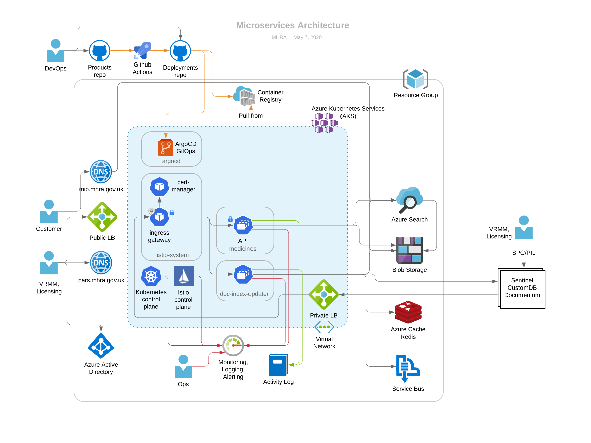

# Project architecture

The diagram above shows how we use Azure’s Kubernetes Service (AKS) to host an API pod for the medicines microservice, a Web pod for the (initially static) website, and a document index updater API pod which Sentinel’s batch export process calls to update documents for the portal. Although each pod is only shown once, there may be multiple instances of each, for reliability (across zones) and scalability (new instances can be created and destroyed automatically and in just a few seconds).

The shaded blue area is a virtual network consisting of 2 subnets, one for the Kubernetes (K8s) cluster and one for an internal loadbalancer, which is accessible from Sentinel batch. The cluster hosts an Istio ingress gateway. This is the entrypoint for all requests incoming from the Internet. It terminates SSL using certificates automatically renewed (from [Let’s Encrypt](https://letsencrypt.org/)) by the certificate manager pod. The gateway allows us to do host- and path-based routing to services within the cluster, and we can apply Istio policies, e.g. rate limiting, here.

Documents are stored in Azure Blob Storage, named after a digest of their contents. This is called content-based addressing and means that two identical documents resolve to the same name giving us deduplication for free. An updated document resolves to a new name, giving us version history for free. We can keep historical documents for ever as storage is very cheap and effectively infinite.

Metadata for the medicines (including lists of associated documents) is attached to each file. Azure Search indexes the documents (pdf and Blob Storage are both supported). Azure search also has AI plugins for features such as phrase detection. This has the potential to give us a rich, relevant search experience similar to that provided by commercially available search engines such as Google or Bing).

The API pod contains a lightweight custom HTTP server, written in Rust. It is stateless so it can scale out easily. It aggregates data from all three sources and presents a documented API that conforms to the [Open API 3.0 specification](https://github.com/OAI/OpenAPI-Specification/blob/master/versions/3.0.2.md). It will be read-only to start with.

The Web pod is the server-side rendering (SSR) part of the `next.js` client-side web application. SSR gives us better SEO and a better user experience (faster initial page load) etc.

The `doc-index-updater` pod is an API for the Sentinel Batch export. It is written in Rust and provides an API for Sentinel batch to call, validates and processes documents before storing data and PDFs to Blob Storage and Azure Search.

## Update for PARS

In order to provide a more streamlined process for updating PARS on the website, the current plan is to add a web portal that will allow medical writers to make changes to the PARS on the site.

This would be a simple, static site, hosted in Azure Blob Storage (as with the current Products and Learning sites). The site would have a form to enter information about the PAR (title, associated PL's, active substances, and so on), and an upload field to upload the PAR in PDF form. The form would be based on a design developed in collaboration with the medical writers, making use of web components provided by gov-uk and would, therefore, conform to the GDS standards.

Access to the form would be restricted to a whitelisted set of IPs, representing MHRA's public IP range, by the CDN. If a user tried to access it from an IP address outside of this range, they would be presented with a blocked access page.

Authentication and authorization would be provided by Azure's Active Directory (AD) service. The email addresses of approved medical writers would be added and assigned to a specific group within Aure AD, that would authorise them to edit PARS.

When arriving at the site (from within MHRA's network), they would be prompted to log-in. Their login request would be validated by Azure AD and an ID JWT token returned. Once completed, the PAR form would be submitted, along with the JWT token, to a new PAR endpoint on the Document Index Updater. An authorization policy in Istio would ensure that any requests to this endpoint are accompanied by a valid, Azure-signed JWT token that contains the necessary claim to make changes to PARS (granted by membership of the group, definted within AD).

The Document Index Updater would then upload the new document to blob storage and the Azure search index being used by the site, after which the document would be instantly accessible on the products website.

There would also be the option within the website form to update an existing PAR, in which case the original PAR would be deleted at the same time that the replacement is created.
